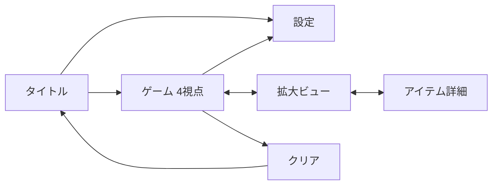

# 企画メモ（Phase 01）

仮タイトル: **『午前3時の部屋』**（他案: 『しらない部屋』『わたしの知らない引き出し』）

| 項目 | 決定 |
| --- | --- |
| 舞台 | 自分の部屋（現代のワンルーム） |
| 視点方式 | 定点カメラ切り替え型（4視点） |
| トーン | しっとり静かなミステリ（怖くはないが雰囲気はある） |
| 目標プレイ時間 | 15〜20分 |
| 謎の数 | 5個 |

---

## 1. コンセプト

> 見慣れた自分の部屋で目を覚ます。でも、部屋には自分の記憶にない物が、ひとつずつ増えている。

「知らない場所からの脱出」ではなく「**知っているはずの場所が少しずつズレている**」不安を軸にする。派手な仕掛けを使わずに雰囲気を出せるので、初作の作り込み量と相性が良い。

## 2. なぜ出られないのか（要決定・A推奨）

自分の部屋である以上、ドアは本来内側から開く。ここの理由づけが作品の背骨になる。

**A案（推奨）— ドアに知らない鍵穴が増えている**

目を覚ますと、自室のドアに見覚えのないダイヤル錠が付いている。部屋の中の「記憶にない物」を調べていくと、それらが錠の手がかりになっている。

- 「違和感を集める」行為がそのまま謎解きになり、テーマと仕掛けが一致する
- 実装は「オブジェクトを調べる」だけで成立し、特殊なギミックが要らない
- 犯人や理由を最後まで明かさずに終わらせても成立する（初作向き）

**B案 — 停電と嵐で外に出られない**

現実的だが「出たい理由」が弱く、緊張感が出にくい。

**C案 — 目覚めたら日付が3日進んでいる**

物語は強いが、失われた3日を説明するテキスト量が増え、初作には重い。

## 3. 部屋のレイアウトと定点カメラ

部屋の中心にカメラを置き、四方を向く4視点。視界外は作り込まなくて済むのが定点方式の利点。

```
              ▲ View 4: クローゼット・窓
              │
 View 1  ◀ ─ [ カメラ位置 ] ─ ▶  View 2
 ドア・玄関         (部屋の中心)      机・本棚
              │
              ▼ View 3: ベッド・サイドテーブル
```

| 視点 | 置くもの |
| --- | --- |
| View 1 | ドア（ダイヤル錠）、靴箱、傘立て、ゴミ箱 |
| View 2 | 机、引き出し（施錠）、ノートPC、本棚 |
| View 3 | ベッド、ベッド下の箱、サイドテーブル、目覚まし時計 |
| View 4 | クローゼット、掛かった上着、窓、カーテン |

## 4. 調べられる箇所（9箇所）

このうち5箇所が謎になり、残りは雰囲気づくりと手がかりの置き場になる。

| # | 箇所 | 役割の想定 |
| --- | --- | --- |
| 1 | ドアのダイヤル錠 | 最終謎（脱出口） |
| 2 | 机の引き出し（施錠） | 中盤の謎 |
| 3 | 本棚の本の並び | 導入の謎（観察） |
| 4 | ノートPC（パスワード） | 中盤の謎 |
| 5 | 目覚まし時計（止まった時刻） | 中盤の謎 |
| 6 | ベッド下の箱 | アイテムの入手元 |
| 7 | クローゼットの上着のポケット | アイテムの入手元 |
| 8 | ゴミ箱 | 手がかり（捨てられたメモ） |
| 9 | 窓・カーテン | 雰囲気＋時刻の手がかり |

「記憶にない物」を1〜2個混ぜておくと、コンセプトが画面で伝わる。

## 5. 操作ルール

| 操作 | 挙動 |
| --- | --- |
| 画面左右の矢印 / スワイプ | 視点を切り替える |
| オブジェクトをタップ | 拡大ビューで調べる |
| 拡大ビューでタップ | アイテム取得 / ギミック操作 |
| インベントリのアイテムをタップ → 対象をタップ | アイテムを使う |
| アイテムを長押し | 詳細表示（裏返す・回す） |
| 戻るボタン | 拡大ビューを解除 |

原則として**タップ以外の操作を要求しない**。フリックやピンチを覚えさせないことで、チュートリアルなしで遊べる状態を狙う。

## 6. 画面遷移



## 7. インベントリUI（ラフ）

- 画面下部に横並びの4〜6スロットを常時表示
- 選択中のアイテムはハイライト（選択したまま対象をタップ＝使う）
- スロットが埋まりすぎないよう、使い終わったアイテムは自動で消える
- 画面上部にはヒントボタンのみ。情報量を絞ってトーンを保つ

## 8. 収益モデル（仮決め）

| 項目 | 方針 |
| --- | --- |
| 基本 | 無料 |
| ヒント | リワード広告を見ると1段階解放（各謎3段階） |
| IAP | 「広告非表示＋ヒント無制限」を300〜500円程度で用意 |
| インタースティシャル | クリア後に1回のみ。プレイ中には挟まない |

静かなトーンの作品でプレイ中に広告を挟むと没入が切れるため、広告はプレイヤーが自分で選んだとき（ヒント）と、終わったあとに限定する。

## 9. アセット方針

- 部屋の箱（壁・床・天井）はプリミティブ＋テクスチャで自作
- 家具は「modern bedroom / apartment interior」系のパックを利用。洋室系のインテリアアセットは選択肢が多い（多くは有料）
- 作り込むのは「調べられる9箇所」のオブジェクトだけ。定点カメラなので視界外は不要

## 10. Phase 02への引き継ぎ

- 「調べられる箇所」9つのうち、謎にする5つを確定させる
- 各謎について 提示 / 気づき / 解法操作 / 報酬 / ヒント3段 を埋める
- ドアのダイヤル錠を最終謎とし、他4つの答えが集まる形にする

---

## 未決定（次に決めること）

- [ ]  出られない理由をA〜Cから確定する
- [ ]  仮タイトルを確定する
- [ ]  「記憶にない物」を具体的に何にするか決める（作品の顔になる）
- [ ]  部屋の主（プレイヤー）の設定をどこまで描くか決める
