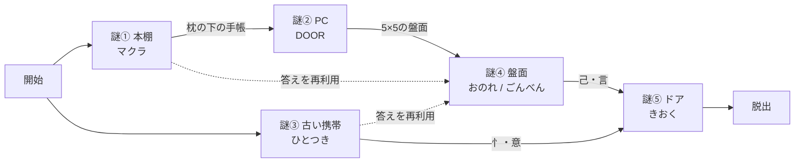

# 謎の設計書（Phase 02 / 第2版）

『午前3時の部屋』／1部屋・謎5個・目標プレイ時間20〜25分

---

## 第2版での変更点

初版の謎③（シートを重ねる）と謎④（カードを傾ける）を全面的に作り直した。

**初版の問題**: どちらも「操作すれば答えが出る」だけで、考える手順が存在しなかった。重ねる・傾けるという物理動作そのものが謎の本体になっており、気づきのステップがない。加えて謎③の答え「0317」は無意味な数字で、以降の謎で一切使われていなかった。

**第2版の方針**: 謎③を携帯文字盤（P102）、謎④を位置関係（P156）で作り直し、**謎①の答えと謎③の答えを、謎④で両方とも材料として使う**構造にした。答えが最後まで意味を持ち続ける。

---

## この設計書の前提

- **著作権の扱い**: SCRAP『謎図鑑』が分類している解法パターン（仕掛けの型）を参照し、「自分の部屋」向けのオリジナル問題として作り直した類題。掲載作品そのものは複製していない。
- **ストーリー前提**: 企画メモのA案（ドアに見覚えのないダイヤル錠が増えている／部屋に記憶にない物がある）。
- **入力方式**: 錠はすべて画面上のダイヤル・キーで入力する。謎を解く前は対象オブジェクトを調べても反応しない（総当たり突破の防止）。

---

## 謎の全体像

| # | 場所（視点） | 参照パターン | 答え | 報酬 |
| --- | --- | --- | --- | --- |
| ① | 本棚（View 2） | 文字数＝個数（P150） | マクラ | 枕の下の古い手帳 |
| ② | 手帳・ノートPC（View 2） | 四季／月（P104） | DOOR | PC画面に5×5のかな盤面 |
| ③ | ゴミ箱の古い携帯（View 1） | 携帯文字盤（P102） | ひとつき | 携帯内の写真に漢字パーツ「忄」「意」 |
| ④ | PC画面の盤面（View 2） | 位置関係（P156） | おのれ／ごんべん | 漢字パーツ「己」「言」 |
| ⑤ | ドア（View 1） | 合体漢字（P60） | きおく | 脱出 |

**答えの再利用が2箇所ある。** 謎④は、謎①の答え「マクラ」と謎③の答え「ひとつき」を盤面に当てて解く。さらに謎②の報酬である盤面そのものが謎④の道具になる。3つの謎の成果が謎④に集約され、そこから最終謎へ渡る。

---

## 謎① 本棚 — 導入・観察系

**参照パターン**: 第3章「文字数＝個数」（P150）

初版から変更なし。

| 項目 | 内容 |
| --- | --- |
| 提示 | 本棚の3段に物が置かれている。上段にマンガ3冊、中段にクリップ4個、下段にグラス3個。棚板の縁に、個数と同じ数のマス目が描かれた札があり、各札の1マスだけが色付き。色付きマスの位置と、物のうち1つに付いた付箋の位置が一致している。 |
| 気づき | 物の個数＝その名前の文字数。色付きマスの位置の文字を上段から読む。 |
| 解法操作 | 札のマスにひらがな3文字を入力。 |
| 報酬 | 枕が調べられるようになり、下から**古い手帳**が出る。 |
| ヒント1 | 「棚のマスの数と、物の数が同じだ」 |
| ヒント2 | 「マンガは3文字、クリップは4文字。物の数は名前の長さを表している」 |
| ヒント3 | 「色付きマスの文字を上から読むと マ・ク・ラ」 |

**検算**: マンガ（3文字）1個目＝マ／クリップ（4文字）1個目＝ク／グラス（3文字）2個目＝ラ → **マクラ**

---

## 謎② 手帳とノートPC — 数字／暗号系

**参照パターン**: 第2章「四季／月」（P104）

報酬のみ変更（初版は漢字パーツ、第2版は謎④で使う盤面）。

| 項目 | 内容 |
| --- | --- |
| 提示 | 古い手帳の見開きに数字の並びが2行。 `9/1  8/2  1/3  →  SUN` `12/1  10/1  11/2  3/3  →  ????` 机のノートPCは英字4文字のパスワードを要求している。 |
| 気づき | 左の数字を「月」として英語に直し、右の数字の位置の文字を読む。例示のSUNが法則を教えている。 |
| 解法操作 | PCに英字4文字を入力。 |
| 報酬 | PC画面に**5×5のかな盤面**と、法則を示す例示が表示される（謎④の道具）。 |
| ヒント1 | 「日付にしては数字が小さい。左は1〜12しかない」 |
| ヒント2 | 「9月はSEPTEMBER。その1文字目はS。例示のSUNはそうやってできている」 |
| ヒント3 | 「DECEMBER・OCTOBER・NOVEMBER・MARCH から順に D・O・O・R」 |

**検算**:
- 例示 — 9/1＝SEPTEMBER 1文字目 S ／ 8/2＝AUGUST 2文字目 U ／ 1/3＝JANUARY 3文字目 N → **SUN**
- 本題 — 12/1＝DECEMBER の D ／ 10/1＝OCTOBER の O ／ 11/2＝NOVEMBER の O ／ 3/3＝MARCH の R → **DOOR**

---

## 謎③ ゴミ箱の古い携帯 — 数字／暗号系【第2版で新規】

**参照パターン**: 第2章「携帯文字盤」（P102）

スマホ向けの作品で、プレイヤー自身がスマホを持って遊んでいる。その手の中の入力方式が謎の題材になるという入れ子構造を狙った。捨てられた古い携帯は「記憶にない物」としてもテーマに乗る。

| 項目 | 内容 |
| --- | --- |
| 提示 | ゴミ箱の中に、見覚えのない古い携帯電話。電源を入れるとロック画面に4つの指示が並んでいる。 `6←　4↓　4↑　2←` メモ画面には前の持ち主の練習書きが残っている。 `3↓ ＝ そ`　`5← ＝ に` |
| 気づき | **携帯のキーパッドとフリック入力**。数字がキー（行）、矢印が方向（段）を示す。中＝あ段、左＝い段、上＝う段、右＝え段、下＝お段。 |
| 解法操作 | 携帯にひらがな4文字を入力してロックを解除する。 |
| 報酬 | 保存されていた写真が表示される。写り込んだ紙に**漢字パーツ「忄」「意」**が書かれている。答えの「ひとつき」は謎④で再利用する。 |
| ヒント1 | 「数字と矢印。この並びは携帯のキーパッドではないか」 |
| ヒント2 | 「メモの `3↓＝そ` は、さ行の下＝そ ということ」 |
| ヒント3 | 「は行の左＝ひ、た行の下＝と、た行の上＝つ、か行の左＝き」 |

**検算**（キー: 1あ 2か 3さ 4た 5な 6は 7ま 8や 9ら 0わ／方向: 中あ 左い 上う 右え 下お）

| 指示 | 行 | 段 | 文字 |
| --- | --- | --- | --- |
| 6← | は行 | い段 | ひ |
| 4↓ | た行 | お段 | と |
| 4↑ | た行 | う段 | つ |
| 2← | か行 | い段 | き |

→ **ひとつき**　／　例示: 3↓＝さ行のお段＝そ ✓　5←＝な行のい段＝に ✓

**設計上の狙い**: 答えの「ひとつき（一月）」は、記憶の抜けている期間を示す言葉として使える。謎の答えがそのままストーリーの手がかりになる。

**実装メモ**: フリック入力の方向対応は機種差があるため、ゲーム内で対応を確定させる。携帯の裏に貼られたシールや取説メモとして、キーと行の対応表（1あ・2か…）を見せておくと親切。

---

## 謎④ PC画面の盤面 — 位置関係【第2版で新規・答えの再利用】

**参照パターン**: 第3章「位置関係」（P156）

**この謎が第2版の中心。** 謎①と謎③で出した答えを、ここで材料として使い直す。

| 項目 | 内容 |
| --- | --- |
| 提示 | 謎②で解錠したPC画面に、5×5のかな盤面と例示が表示されている。 例示: `まと → おん` 入力欄: `まくら → ？？？`　`ひとつき → ？？？？` |
| 気づき | **盤面で指定された文字を探し、その真下の文字を読む**。これまでに出した2つの答えを盤面に当てる。 |
| 解法操作 | 盤面の下の入力欄に、ひらがな3文字と4文字を入力。 |
| 報酬 | 「おのれ」＝己、「ごんべん」＝言。**漢字パーツ「己」「言」**を入手。 |
| ヒント1 | 「例示の『まと』と『おん』は、盤面で縦に並んでいる」 |
| ヒント2 | 「これまでに解いた謎の答えを、盤面で探してみよう」 |
| ヒント3 | 「まくら→おのれ、ひとつき→ごんべん。それぞれ漢字のパーツの名前」 |

**盤面**

| | 列1 | 列2 | 列3 | 列4 | 列5 |
| --- | --- | --- | --- | --- | --- |
| **行1** | ま | せ | ひ | ぬ | と |
| **行2** | お | か | ご | み | ん |
| **行3** | つ | く | よ | き | ら |
| **行4** | べ | の | た | ん | れ |
| **行5** | ゆ | さ | ほ | む | え |

**検算**

- 例示: ま(1,1)の下＝お ／ と(1,5)の下＝ん → **おん** ✓
- まくら: ま(1,1)→お ／ く(3,2)→の ／ ら(3,5)→れ → **おのれ** ＝ 己 ✓
- ひとつき: ひ(1,3)→ご ／ と(1,5)→ん ／ つ(3,1)→べ ／ き(3,4)→ん → **ごんべん** ＝ 言 ✓

**盤面の検証**: 探す対象の7文字（ま・く・ら・ひ・と・つ・き）は、いずれも盤面に1つしか存在しない。曖昧さは生じない。「ん」だけは2箇所（2,5）（4,4）にあるが、これは読み取り先なので問題ない。行5の文字には下がないが、探す文字は行5に含まれない。

**実装メモ**: 「おのれ」「ごんべん」から漢字パーツに変換する小さな気づきがもう一段ある。ここで詰まる人が出たら、パーツ側に読みを併記する形に緩める。

---

## 謎⑤ ドア — 最終謎

**参照パターン**: 第1章「合体漢字」（P60）

初版から変更なし。パーツの入手元だけが変わった（謎③と謎④）。

| 項目 | 内容 |
| --- | --- |
| 提示 | ドアのダイヤル錠はひらがな3文字。脇の走り書き「4つを合わせて 熟語をつくり ひらがなで答えろ」。手元には謎④の「言」「己」と、謎③の「忄」「意」。 |
| 気づき | 4つのパーツを2つずつ組み合わせると「記」と「憶」になる。 |
| 解法操作 | ダイヤルを「き」「お」「く」に合わせる。 |
| 報酬 | ドアが開く。脱出。 |
| ヒント1 | 「4つのパーツは2つずつ組み合わさるらしい」 |
| ヒント2 | 「言＋己で1つの漢字になる。残り2つも同じように」 |
| ヒント3 | 「記＋憶＝記憶。答えは きおく」 |

**検算**: 記＝言＋己 ／ 憶＝忄＋意 → 記憶 → **きおく**

---

## 机上プレイの検証結果

**所要時間の見積もり**

| 区間 | 想定 |
| --- | --- |
| 部屋の探索（初回の見回し） | 4〜5分 |
| 謎① | 2〜3分 |
| 謎② | 4〜5分 |
| 謎③ | 4〜5分 |
| 謎④ | 4〜5分 |
| 謎⑤ | 3〜4分 |
| **合計** | **21〜27分** |

初版より長い。謎④が3つの謎の成果を束ねる分、考える時間が増えた。目標の20分に寄せるなら謎①を簡略化するのが一番影響が小さい。

**デッドロックの確認**

- 開始直後に着手できる謎が2つある（謎①＝本棚 View 2／謎③＝ゴミ箱 View 1）。片方で詰まってももう一方に進める ✓
- 謎④は謎①・②・③すべての成果を必要とする合流点。ただし両ルートとも独立して最後まで進められるため、片側で止まっても手が完全に止まることはない ✓
- 取り逃すと進めなくなるアイテムはない。手帳・携帯はいつでも再確認できる ✓
- 謎①と謎③の答えは、解いた後もプレイヤーの手元に残す必要がある。**解いた謎の答えを一覧できるメモ機能をUIに用意すること**（謎④で必須。第2版で新たに発生した要件） ✓

**進行フラグ一覧（Phase 03へ引き継ぎ）**

| フラグ | 意味 |
| --- | --- |
| `puzzle01_solved` | 答え「マクラ」記録／枕が調べられる |
| `item_notebook` | 古い手帳を所持 |
| `puzzle02_solved` | PC解錠／盤面が閲覧可能 |
| `item_phone` | 古い携帯を所持 |
| `puzzle03_solved` | 答え「ひとつき」記録／パーツ忄・意を入手 |
| `puzzle04_solved` | パーツ己・言を入手 |
| `puzzle05_solved` | 脱出（クリア） |

---

## 部屋の配置（更新版）

| 視点 | 調べられる箇所 |
| --- | --- |
| View 1（ドア） | ドアのダイヤル錠（謎⑤）、**ゴミ箱＝古い携帯**（謎③）、靴箱、傘立て |
| View 2（机・本棚） | 本棚のマンガ／クリップ／グラス（謎①）、ノートPC（謎②・謎④）、机の引き出し |
| View 3（ベッド） | 枕（謎①の報酬）、ベッド下、目覚まし時計 |
| View 4（クローゼット・窓） | 上着、クローゼット、カーテン、窓 |

初版で謎に使っていたクローゼットのシートと、ベッド下の箱は不要になった。View 4は雰囲気づくりと「記憶にない物」の置き場として使う。View 3も同様に軽くなったので、目覚まし時計に「止まった時刻」を仕込むなど、後から伏線を足す余地がある。

---

## 次に判断が必要なこと

- [ ]  ストーリーのA案（ドアに知らない鍵穴）を確定する
- [ ]  「記憶にない物」を具体的に何にするか決める（古い携帯はその1つとして機能する）
- [ ]  謎③の答え「ひとつき」を、失われた期間としてストーリーに明示するか決める
- [ ]  View 3・View 4が軽くなった分、探索の見どころを足すか決める
